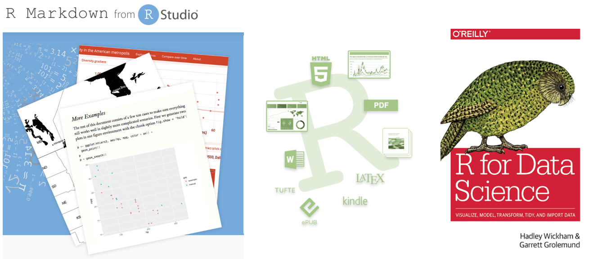

```{r setup, include=FALSE}
knitr::opts_chunk$set(echo = FALSE)
```

## ¿Qué podemos hacer con R? (I)

<br><br>

{width=103%}
**Fuente:** How to quickly produce statistical reports? The UNHCR "Cookbook" (2019). 

<br>

## ¿Qué podemos hacer con R? (II)

{ width=98% }

## ¿Qué es RMarkdown?

### 1) Estructura unificada que permite combinar:

- Código de R
- Resultados
- Comentarios (texto)
      
### 2) Los documentos R Markdown:

- Son completamente reproducibles, se pueden regenerar automáticamente al actualizar tanto códigos R o datos empleados.

- Se pueden convertir en en diferentes formatos como: HTML, PDF, documentos Word, aplicaciones web interactivas, entre otros.

<br>

## Empecemos con RMarkdown! 

### 1) File -> New File -> R Notebook

### 2) Guardar el archivo **.Rmd** en alguna carpeta o proyecto.

### 3) Seleccionar la opción **Knit** y se generará un archivo HTML.

<br>

## Título del documento

### Encabezado contiene algunos metadatos: 

- title: "Mi primer reporte en R"
- author: "Maria Gracia Becerra"
- date: "25/11/2019"
- output: html_document

<br>

## Texto

### Encabezados

- `#`, encabezado de nivel 1
- `##`, encabezado de nivel 2
- `###`, encabezado de nivel 3

### Listas

- Listas con viñetas, usar `*` o `-` .
- Listas enumeradas, usar los números seguidos de un punto `1.`, `2.`, ...

### Cursiva y Negrita

- Para cursiva, el texto va entre asteriscos.
- Para negrita, el texto va entre dos asteriscos.

<br>

## Códigos R (*chunks*)

#### Botón Insert -> R 

 

#### ¿Cómo controlamos un chunk?

 - `eval = FALSE`, no se evalúa el código.
 -  `include = FALSE`, evalúa el código pero no muestra los resultados.
 -  `echo = FALSE`, no muestra el código, pero sí los resultados obtenidos.
 - `message = FALSE`, evita mostrar mensajes en el documento.
 - `warning = FALSE`, evita mostrar warnings en el documento.

#### Podemos combinar código en R con texto, usar comillas simples!  

<br>

## Caso práctico

#### El flujo de personas con necesidades específicas ha aumentado drásticamente durante el mes de noviembre. Diariamente, **más de 2,000 personas esperan para poder realizar un ingreso regular a Perú**. Para responder a las necesidades de esta población, distintas organizaciones coordinan para brindar una **asistencia conjunta**. Para ello, están utilizando Kobo para hacer el registro de la asistencia entregada. Usted debe elaborar **varios reportes diarios** para informar sobre la respuesta a la emergencia. 

<br/><br/>

#### Puede entrar al link de kobo [**aquí**.](https://enketo.unhcr.org/x/#4kXNmJjb)

<br>

## ¿Cómo conectar Kobo con R? (I)

Instalamos paquetes y funciones necesarias:
```{r echo = T, results = "hide", warning=FALSE, message=FALSE}
#Si es necesario, deberán instalar los paquetes
library(devtools)
library(httr)
library(jsonlite)
library(readr)
library(dplyr)
source_url("https://raw.githubusercontent.com/ppsapkota/kobohr_apitoolbox/master/R/r_func_ps_kobo_utils.R")
```

Credenciales de la cuenta:
```{r echo = T, results = "hide", warning=FALSE, message=FALSE}
kobo_user <- "ejemplor"
kobo_pw <- "Taller2019!"
```

<br>

## ¿Cómo conectar Kobo con R? (II)

Identificamos el formulario que queremos cargar:
```{r echo = T, results = "hide", warning=FALSE, message=FALSE}
url <-"https://kobocat.unhcr.org/api/v1/data.csv"
d_formlist_csv <- kobohr_getforms_csv (url,kobo_user, kobo_pw)
d_formlist_csv <- as.data.frame(d_formlist_csv)
d_formlist_csv #ver
```

Cargamos el formulario! 
```{r echo = T, results = "hide", warning=FALSE, message=FALSE}
url<- "https://kobocat.unhcr.org/api/v1/data/19694.csv"
data <- kobohr_getdata_csv(url,kobo_user,kobo_pw) 

head(data) #resultado
```

<br>

## ¿Cómo podemos realizar consultas en R? 

- Número de personas atendidas

```{r echo = T, results = "hide", warning=FALSE, message=FALSE}
nrow(data)
```

- Total de asistencia otorgada

```{r echo = T, results = "hide", warning=FALSE, message=FALSE}
sum(data$cantidad)
```

- Número de organizaciones humanitarias brindando asistencia:

```{r echo = T, results = "hide", warning=FALSE, message=FALSE}
length(unique(data$org))
```

<br>


## ¿Cómo podemos crear una tabla? 

Primero debemos organizar la información que queremos mostrar!

```{r echo = T, results = "hide", warning=FALSE, message=FALSE}
#creamos la tabla
tabla1 <- data %>% 
  group_by(distribucion) %>% 
  summarise(Total = sum(cantidad)) %>%
  mutate(Freq = Total / sum(Total))

#ordenamos la tabla de mayor a menor
tabla1 = tabla1[order(-tabla1$Total),]
tabla1
```

Usamos kable para visualizar nuestra información: 

```{r echo = T, results = "hide", warning=FALSE, message=FALSE}
knitr::kable(tabla1)
```

<br>


## ¿Qué hemos aprendido?

<br>

### - Conectar Kobo con R. 

### - Escribir un reporte con el paquete R Markdown :D.

### - Generar diferentes formatos de reportes reproducibles.

### - Entender la importancia de la **reproducibilidad** en el contexto humanitario!

<br>

## Recursos adicionales!

### - [**Sitio oficial de R Markdown**](https://rmarkdown.rstudio.com)

### - [**R Markdown: The Definitive Guide**](https://bookdown.org/yihui/rmarkdown/) 

### - [**R Markdown Cheatsheet**](https://www.rstudio.com/resources/cheatsheets/)

### - [**R Markdown Reference Guide**](https://www.rstudio.com/wp-content/uploads/2015/03/rmarkdown-reference.pdf)

<br>


<br>

#

<br><br>
<br><br>
<br><br>
<br><br>

<center> <h2> Muchas gracias! </h2> </center> 


<br>