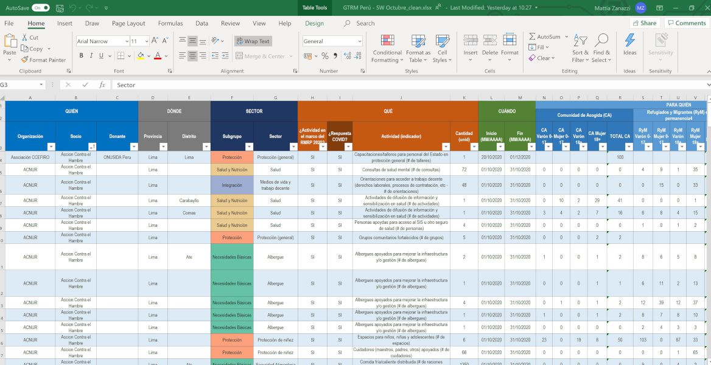

```{r setup, include=FALSE}
knitr::opts_chunk$set(echo = TRUE)
```

## PUNTOS

* **Contexto**

<br>

* **Flujo de datos**

<br>

* **Importar y validar los datos**

<br>

* **Cálculos de totales sectoriales/intersectoriales**

<br>

* **Próximos pasos**


## 1. Contexto

El GTRM Perú se encarga de la **preparación y monitoreo del Plan de Respuesta para Refugiados y Migrantes** (RMRP) de Venezuela.

<br>

En este contexto, el equipo de IM del GTRM organiza:

- Un **Análisis Conjunto de Necesidades**;
- La definición de **prioridades y objetivos operacionales**;
- La preparación de un **Marco de Monitoreo** para estos objetivos;
- El **monitoreo** de la respuesta bajo este marco.

<br>

Las rondas mensuales de 5W representan este último paso. De una perspectiva de coordinación, es esencial poder monitorear y visibilizar la respuesta en curso.


## 2. Flujo de datos

El flujo de datos para la 5W es el siguiente:

* Los **socios del GTRM** reportan sus actividades de forma mensual a través de una matriz en línea.

 { width=30% }

<br>

* El **equipo de manejo de información**:
  + **Descarga** la matriz;
  + **Limpia y valida** los datos;
  + **Agrega** la información para obtener totales sectoriales e intersectoriales;
  + **Comparte** la información a través de dashboards y otros productos.

## 3. Importar y validar los datos


Se importan los datos y se hace una primera ronda de limpieza:
 
```{r eval=FALSE}

library(readxl)
library(plyr)
library(tidyverse)
library(openxlsx)

LIMA <- read_excel(path=DATA_path, sheet="Lima", skip = 2)
LIMA$Departamento <- "Lima"
LIMA[,14:28] <- lapply(LIMA[,14:28], as.numeric)
LIMA$Organización <- trimws(LIMA$Organización)
...
DATA_ALL <- bind_rows(LIMA, TUMBES, TACNA, OTROS_DEP) 
DATA_ALL <- DATA_ALL %>% 
  filter(!is.na(Organización))
rm(LIMA, TUMBES, TACNA, OTROS_DEP)
```
 
## 3. Importar y validar los datos (2)

R también puede identificar errores en los datos enviados:

```{r eval=FALSE}
# El total de rangos de sexo/edad corresponde al total reportado?
DATA_ALL_CHECK <- DATA_ALL
DATA_ALL_CHECK$CA_SUM <- rowSums(DATA_ALL_CHECK[,14:17]) 
DATA_ALL_CHECK$CA_SUM_CHECK[DATA_ALL_CHECK$CA_SUM != DATA_ALL_CHECK$`TOTAL CA`] <- "ERROR" 

# Se reportó información hasta el nivel Admin2?
DATA_ALL_CHECK$PROVINCE_REPORTED[DATA_ALL_CHECK$Provincia == ""] <- "ERROR" 

# La lógica de Admin1/Admin2 es correcta?
DATA_ALL <- left_join(DATA_ALL, ADMIN2, by="Provincia")
DATA_ALL_CHECK$PROVINCE_CORRECT[DATA_ALL_CHECK$Departamento != DATA_ALL_CHECK$ADM1_ES.y] <- "ERROR" 

# Exportar el log de errores para hacer seguimiento
error_log <- list("ERRORS" = DATA_ALL_CHECK)
write.xlsx(DATA_ALL_CHECK, file="ERROR_log.xlsx")

```

*Nota: Estos pasos se pueden evitar utilizando una plataforma con reglas de validación predefinidas.*

El script exporta un archivo Excel con todos los errores identificados. A través de este registro, es posible hacer un seguimiento sistemático con cada organización.


## 4. Calcular total de beneficiarios

Desde el marco de monitoreo, se puede hacer una distinción entre los beneficiarios reportados:

* **Totales que se pueden calcular** para el total sectorial:
  + Los beneficiarios se pueden sumar entre socios (no hay duplicación);
  + Los beneficiarios no se pueden sumar entre socios (riesgo de duplicación): Se toma el MAX;
* **Totales que no se puede calcular** para el total sectorial (por ejemplo, beneficiarios indirectos):
  + No se considera la cifras de beneficiarios para el total.

```{r eval=FALSE}

DepartmentActTotal = function(df) { 
  df1 = filter(df, `Rule_BNF` == "SUM") #### Si se cuentan y se puede sumar
  df2 = ddply(df1[c(4, 7, 10, 15:29)], .(Departamento, Sector, Actividad), numcolwise(sum, na.rm=T))
  df3 <- filter(df, `Rule_BNF` == "MAX") #### Si se cuentan y NO se puede sumar
  df4 = ddply(df3[c(4, 7, 10, 15:29)], .(Departamento, Sector, Actividad), numcolwise(max, na.rm=T))
  df5 <- filter(df, `Rule_BNF` == "N/A")#### Si NO se cuentan
  df5[c(15:29)] <- 0
  df6 = ddply(df5[c(4, 7, 10, 15:29)], .(Departamento, Sector, Actividad), numcolwise(sum, na.rm=T))
  df7 = rbind(df2, df4, df6)) #### Juntando todos
  return(df7)
} 
DATA_ACT_Departamentos <- DepartmentActTotal(DATA_ALL)

```


## 4. Calcular total de beneficiarios (2)

El total de beneficiarios a nivel intersectorial se produce desde:

* Cálculo de totales sectoriales en una área geográfica;
* Selección del valor máximo entre los sectores para esta área **= total intersectorial local**
* Suma de los valores máximos entre todas las áreas geográficas **= total intersectorial nacional**

```{r eval=FALSE}
IntersectorTotal = function(df) {
  df1 = ddply(df[c(1, 6:20)], .(Departamento), numcolwise(max, na.rm=T))
  df2b = mutate(df2, `Pais` = "Nacional")
  df3 = ddply(df[c(18, 3:17)], .(Pais), numcolwise(sum, na.rm=T))
  return(df3)
} 
TOTAL_Intersector <- DepartmentTotal(Total_Sector_Departamentos) # Intersector by department (all)


```


## 4. Calcular total de beneficiarios (3)

<br>

El total de beneficiarios se prepara para las siguientes categorías:

* Total geográfico (Admin1, Admin2, Admin3);
* Total sectorial;
* Total para actividades bajo el RMRP;
* Total para actividades relacionadas al COVID

Y otras. Y combinaciones de estas categorías.

<br>

En total, se exportan casi 30 diferentes matrices desde los datos de la 5W, sin incluir los formatos regionales y otros cálculos para totales acumulados.

## 5. Los próximos pasos

<br>

El trabajo con R al momento se enfoca únicamente sobre la **transformación y agregación de datos**.

En futuro, el equipo quiere incorporar R para los siguientes pasos:

* **Descarga** de datos desde plataforma en línea
* **Visualización** de información a través de reportes y otros productos
* **Upload de datos** en plataformas en línea
* **Compartir** el código en línea


El objetivo es asegurar un control de **todo el flujo de datos** de monitoreo de forma sistemática, automatizada y transparente con todos los socios del GTRM.

