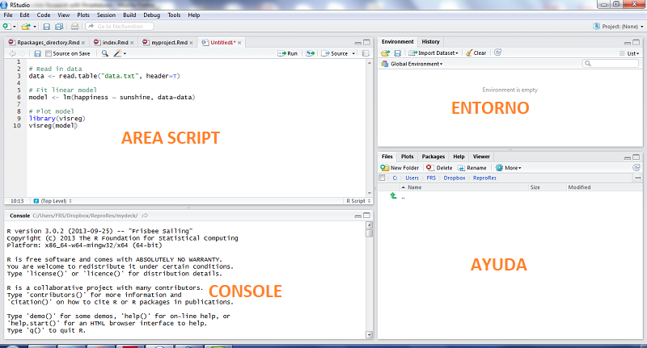

```{r setup, include=FALSE}
knitr::opts_chunk$set(echo = FALSE)
```

## Bienvenidos

<br>

**Bienvenidos a nuestra capacitación en R para manejo de información!**
<br>
<br>


Vamos a pasar este día aprendiendo sobre la herramienta R y todas sus funcionalidades para nuestro trabajo :)
<br>
<br>


-- Equipo GTRM Perú


## Qué es R?

<br>
1. **Lenguaje de programación** con enfoque al análisis estadístico

<br>
2. Uno de los **lenguajes estadísticos** más utilizados en investigación cientifica

<br>
3. Una de las herramientas más importantes para **data science**


## Organizaciones que utilizan R

 { width=20% }      { width=20% }    
 { width=20% }   { width=5% }     
 { width=5% }     { width=20% } 
 
 


## R en los sectores humanitarios y de desarrollo

**Taller en Amman (5-6 Noviembre, 2018)**  { width=50% }
 
 
**Visión para el futuro:**

R, cómo lenguaje y a través de las herramientas/paquetes que lo constituyen, es la opción de preferencia de nuestra comunidad porqué permite:

- Abarcar las brechas con buenas prácticas desde las industria de data science y de la academia;

- Minimizar las dependencias de un único proveedor, licencia u organización;

- Construir y expander los conocimientos entre organizaciones diferentes.


<font size="2">Para más información: https://humanitarian-user-group.github.io/post/first-meeting/</font>


## Porqué utilizar R en lugar de Excel?

<br>

- **Para los estadísticos:** Fuentes de datos demasiado grandes para Excel, "Big Data"

<br>

- **Más común en IM:** Ganar tiempo haciendo tareas repetitivas

<br>

- **Para ambos:** Asegurar trabajo reproducible

<br>

Y también: 100% gratuito y open source!


## Desde "clic" hacia "script" (1)

Un flujo de trabajo tradicional es el siguiente:
<br>

1. Ingresar en Kobo, ir al formulario, descargar los datos; { width=7% }

<br>

2. Abrir el archivo en Excel, transformar datos manualmente (copiar, pegar, tablas dinámicas, etc) y preparar gráficos { width=5% }

3. Exportar datos para preparar mapas en GIS;{ width=7% }

4. Abrir Word para añadir el narrativo, copiar y pegar gráficos/mapas; { width=6% }

5. O: Juntar todo en un documento con Adobe Illustrator/InDesign. { width=5% }
<br>


## Desde "clic" hacia "script" (2)

Este flujo de trabajo **no** es lo más efectivo, sobre todo si el dataset utilizado cambia en continuación (por ejemplo con una encuesta Kobo):

- Los datos son manipulados haciendo clic manualmente;
- Los datos son exportados desde una herramienta hacia una otra (Excel, GIS, Word), utilizando varios formatos;
- Los resultados (gráficos, tablas), con copiados y pegados **manualmente** en el formato de publicación final.

**Este proceso es laborioso y deja un gran potencial para errores!**

{ width=20% }


## Desde "clic" hacia "script" (3)

Unas preguntas y problemas típicos revisando un análisis:

- Cuales cálculos se hicieron para llegar a las cifras? 

- Tomaron en consideración x, y, z para el análisis?

- Se identificaron outliers?

- Ups! Hay un error / queremos hacer una revisión en los datos! Podemos repetir el análisis? Necesitamos las cifras, gráficos y tablas para el informe / presentación en media hora!

- Como co-autor o lector de un informe, quiero ver el proceso de investigación (como llegamos a una conclusión) y no solo el producto final con cifras/tablas agregadas.


## Desde "clic" hacia "script" (4)

Si todos los pasos de manejo de datos, análisis, visualización son hechos a través de una seria de comandos **escritos en script**, en lugar de **dozenas de clics**:

- Una vez identificado un error en los datos, o utilizando diferentes datasets, solo se necesita hacer cambios en el script y el informe se actualizará automaticamente;

- El manejo de datos deviene *de facto* llenamiente documentado (no se necesitan cambios manuales en Excel);

- El análisis es documentado y listo para una revisión colaborativa;

<br>
<br>
<br>
<br>
<br>
<br>

<font size="2">Estas diapositivas son adaptadas desde la presentación de Edouard Legoupil: http://edouard-legoupil.github.io/humanitaRian-data-science/</font>


# Primeros pasos en R

- La interfaz visual de RStudio
- Los paquetes de R
- Elementos básicos de R (paquete Swirl)
  - Primeros pasos
  - Vectores
  - Matrices y marcos de datos

## Empezamos!

Una distinción importante:

<br>

- **R** es el lenguaje de programación
  - Instalar **R**: https://cran.r-project.org/bin/windows/base/ 

<br>

- **RStudio** es la interfaz para utilizar R
  - Instalar **RStudio**: https://www.rstudio.com/products/rstudio/download/ 

  
## Interfaz visual de RStudio


{ width=100% }

  

## Los paquetes de R

<br>
- R tiene una variedad enorme de usos: Si los incluyera todos, sería demasiado pesado!

<br>
- La versión base de R tiene varios comandos básicos;


<br>
-	Los paquetes son **extensiones** de las funcionalidades básicas de R para usos específicos;

<br>
-	Paquetes oficiales están en la plataforma CRAN;
__
<br>
-	Paquetes nuevos/especificos se pueden también descargar desde otras fuentes.


## Elementos básicos de R: Ejercicios individuales

En la Console, insertar los comandos siguientes (INGRESAR después cada comando):
<br>

```{r}

- install.packages("swirl")

- library("swirl")

- select_language("spanish")

- swirl()

```

Después, seleccionar "1: R Programming" y vamos a seguir los módulos 1, 4 y 7. 


## Elementos básicos de R

- Cómo interactuar con R

- Cálculos: 5 + 7

- Operatores: +, -, *, /, ^, sqrt()

- Crear variable: x <- 5+7

- Vectores: c(1, 2, 3)

- Buscar ayuda: ?función


## Vectores

- Tipos de vectores:

  - Numérico: 1, 2.5, 1000
  
  - Lógico: TRUE, FALSE
  
  - Carácter: "hola"
  
  - Otros
  
- Operadores lógicos: <, >, <=, >=, ==, !=, |, &

- Función paste()

## Matrices

- Datos "rectangulares": Como hojas de cálculo Excel
<br>

- Matrix: Mismo tipos de vectores

- Marco de datos: Diversos tipos de vectores (más común para nosotros!)
<br>

- Dimensiones: dim(x) Como las filas y columnas

- Largo: length(x)

- Tipo: class(x)

- Combinar columnas: cbind()

- Combinar filas: rbind()

- Nuevas matrices: matrix()

- Nuevos marcos de datos: data.frame()

- Cambiar nombre a columnas: colnames()

