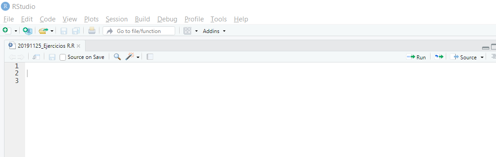
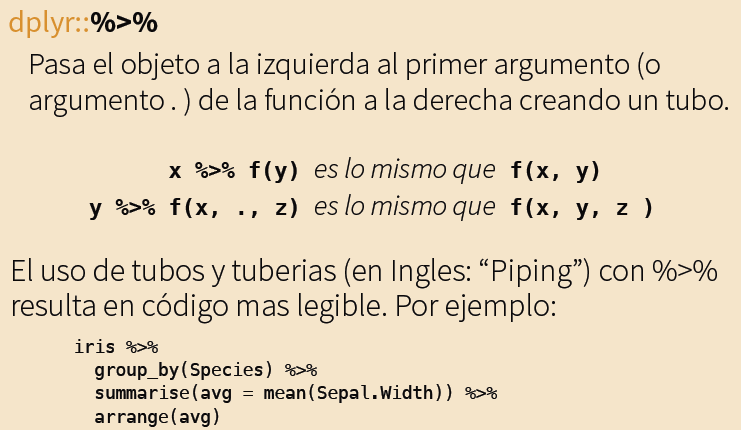
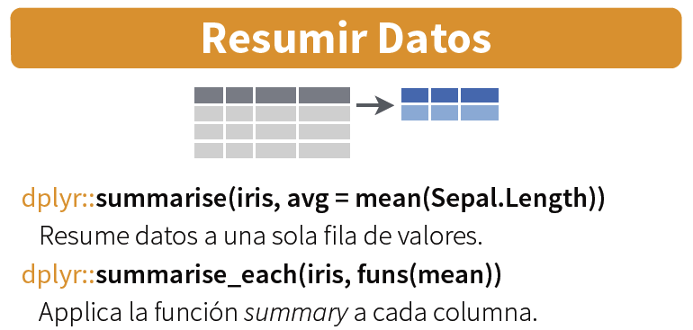
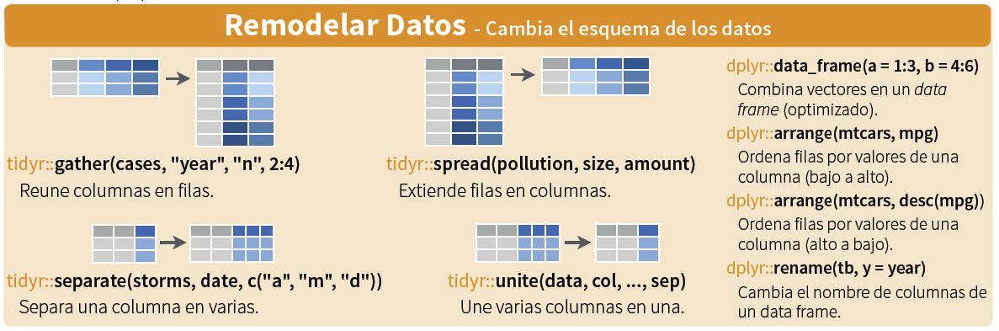
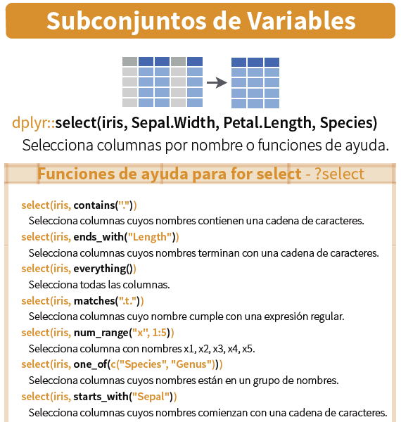
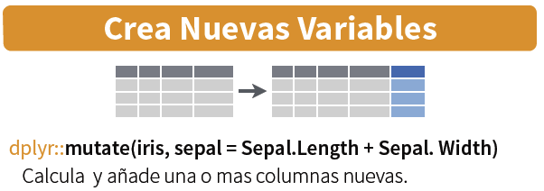
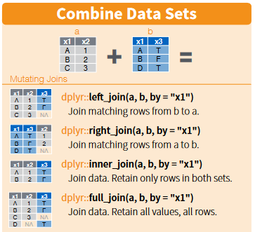

```{r setup, include=FALSE}
knitr::opts_chunk$set(echo = FALSE)
```

# Transformación de datos en R

Introducción al tidyverse!


## Qué es el tidyverse?

El "tidyverse" es un grupo de paquetes utilizado (sobre todo) para la manipulación de datos en R.

  
 
 <br>
 <br>
 Esta sesión se concentrará solo sobre algunas funcionalidades del tidyverse, en particular:
 
 - **tidyr** 
 - **dplyr**
 

## Qué vamos a aprender

- **Importar** datos
- **Sumar y agregar** datos
- **Filtrar** valores
- **Seleccionar** variables
- **Cambiar formato** de datos (ancho-largo)
- **Crear** nuevas variables
- **Combinar** tablas


## Empezamos!

- Creamos un nuevo archivo script: File > New File > R Script
- Guardarlo como "20191125_Ejercicios R"

  

<br>

- Esto será el script para nuestra sesión. Guardarlo periodicamente!

## Instalar tidyverse

Antes de empezar, necesitamos instalar tidyverse (y un otro paquete para importar archivos Excel). Podemos ingresar este código en la console:


```{r}

install.packages("tidyverse")
install.packages("readxl")

```

En nuestro script vamos a poner el código siguiente:

```{r}

library("tidyverse")
library("readxl")

```

## Importar datos en R

**Para nuestro ejercicio vamos a utilizar los datos del RMRP 2020 Perú. **

Los datos son en un archivo Excel con dos pestañas: 

- **Actividades planeadas** por los socios a nivel de departamento y de sector;
- **Proyecciones** de población total y cálculo de **personas con necesidades**;

Para importar los datos, vamos a utilizar la función "read_excel" y guardarlos en dos tablas:

```{r}

Actividades <- read_excel(path="Datos/20191125_RMRP_Datos.xlsx", sheet="Actividades")

Proyecciones <- read_excel(path="Datos/20191125_RMRP_Datos.xlsx", sheet="Población")

```

## Visualizar los datos

Podemos utilizar la función "dim" para tener una idea de las dimensiones de nuestros datos:

```{r}

dim(Actividades)
dim(Proyecciones)

```

Utilizamos función "str" para ver la estructura de los datos:


```{r}

str(Actividades)
str(Proyecciones)

```

La función "summary" nos permite de ver más detalles:


```{r}

summary(Actividades)
summary(Proyecciones)

```

## Armonizar formatos de tablas

Las tablas incluyen datos sobre número de actividades y proyecciones poblacionales a nivel de departamento.

<br>

**Sin embargo, los dos formatos son diferentes!**

<br>

- En Proyecciones, cada departamento es una fila única;
- En Actividades, los departamentos se repiten para cada organización y cada sector.

<br>
Para conducir un análisis, queremos **armonizar los formatos y juntar las tablas.**


## Antes de empezar: cómo hacer un tubo!


Ya conocemos cómo formular las funciones de R y asignar el valor a una nueva variable:

```{r}

Var2 <- función(Var1)

```
Pero cómo hacemos si queremos aplicar dos o más funciones consecutivas a una variable?

```{r}

Var2 <- función1(Var1)

Var3 <- función2(Var2)

Var3 <- función3(Var3)

...

```

Esto es un proceso **ineficiente**.


## Antes de empezar: cómo hacer un tubo! (2)


El paquete "dplyr" del tidyverse nos permite juntar nuestros pasos a través del operador " %>% ":

```{r}

Var2 <- Var1 %>% 
  función1 %>% 
  función2

```

 { width=50% }

Pueden añadir este operador con ctrl + shift + M.

## Sumar y agregar datos

Primero, queremos agregar los datos a nivel de sector y departamento (sin considerar las organizaciones).

Para sumar los valores, utilizamos la función "summarise":

 { width=50% }

## Sumar y agregar datos (2)

En nuestro script:

```{r}

Actividades_Agregadas <- Actividades %>% 
  group_by(Departamento, Sector) %>% 
  summarise(Actividades_sum = sum(Actividades))

```

Hemos creado una nueva tabla "Actividades_Agregadas" con valores sumados para cada departamento y sector!


## Filtrar valores

En mi tabla, hay valores para actividades nacionales, donde no se específican los departamentos.

Para nuestro ejercicio, no queremos considerar estas actividades porqué queremos comparar los departamentos.

Los podemos filtrar a través de la función "filter":

 { width=50% }
 
 <br>
 En nuestro script:

```{r}

Actividades_Agregadas <- filter(Actividades_Agregadas, Departamento != "Nacional")

```


## Cambiar estructura de la tabla

Aún no podemos comparar bien nuestras tablas. Queremos una fila única para cada departamento!

La función "spread" nos permite hacer justamente esto:

 { width=80% }

En nuestro script:

```{r}

Actividades_Agregadas <- Actividades_Agregadas %>% 
  spread(Sector, Actividades_sum)

```

Ahora nuestra tabla tiene una fila para cada departamento.

## Seleccionar variables

Nuestra nueva tabla "Actividades_Agregadas" contiene columnas para cada sector. Podemos seleccionar las columnas que nos interesan a través de la función "select":

 { width=40% }


## Seleccionar variables

Para hacer nuestro análisis más sencillo, vamos a enfocarnos solamente sobre los sectores de **Protección** e **Integración**:


```{r}

Actividades_Agregadas <- select(Actividades_Agregadas, Departamento, Protección, Integración)

```

## Añadir nuevas columnas

Antes de combinar nuestras tablas, queremos tener una columna con el **total de actividades en cada departamento**.

La función "mutate" nos permite hacer esto:

 { width=60% }

<br>

En nuestro script:

```{r}

Actividades_Agregadas <- Actividades_Agregadas %>% 
  replace(is.na(.), 0) %>%
  mutate(Sum_Act = Protección + Integración)


```

## By the way..

Gracias al operador " %>% ", todos estos pasos pueden ser hechos conjuntamente!

```{r}

Actividades_Agregadas <- Actividades %>% 
  group_by(Departamento, Sector) %>% 
  summarise(Actividades_sum = sum(Actividades)) %>% 
  spread(Sector, Actividades_sum) %>% 
  replace(is.na(.), 0) %>%
  mutate(Sum_Act = Protección + Integración)

```

 { width=20% }


## Combinar tablas

Para hacer nuestro análisis, queremos juntar nuestras dos tablas en una.

R nos permite hacer esto gracias a la función "join".

Hay cuatro tipos de join:


  


## Combinar tablas

Para nuestra tabla, vamos a utilizar la función "left_join":

```{r}

colnames(Proyecciones)[1] <- "Departamento"

RMRP_Datos <- left_join(Proyecciones, Actividades_Agregadas, by = "Departamento")

```


Luego podemos verificar que todos los datos sean combinados:

```{r}

summary(RMRP_Datos)
summary(Actividades_Agregadas)

```


## Revisiones finales


Dado que nuestro análisis va a ser solo sobre Protección e Integracíon, no necesitamos otros sectores:

```{r}

RMRP_Datos <- select(RMRP_Datos, Departamento, contains("Proyeccion"), contains("Protección"),
contains("Integración"), Sum_Act)

```

## Para recapitular

- **Importar** datos: read_excel
- **Sumar y agregar** datos: summarise
- **Filtrar** valores: filter
- **Seleccionar** variables: select
- **Cambiar formato** de datos (ancho-largo): spread
- **Crear** nuevas variables: mutate
- **Combinar** tablas: join


